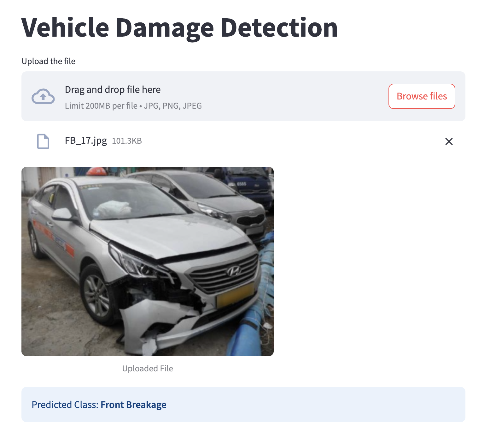

#  Vehicle Damage Detection App  

This application utilizes **deep learning** to classify **vehicle damage** from images.  
Users can **upload a car image**, and the model will identify whether the **front or rear part is normal, crushed, or broken**.  

The system is built using **FastAPI for the backend** and **Streamlit for the frontend**, making it easy to deploy and interact with.  
The model is trained to work best with **third-quarter front and rear views** of a car.  

## Features  
- **AI-powered vehicle damage classification**  
- **FastAPI backend** for quick predictions  
- **Streamlit UI** for an intuitive experience  
- **ResNet50-based deep learning model**  
- Supports **real-time image uploads**  

## Model Details  

- **Architecture:** ResNet50 (Transfer Learning)  
- **Dataset:** 1,725 images labeled into **6 target classes**:  
  1. **Front Normal**  
  2. **Front Crushed**  
  3. **Front Breakage**  
  4. **Rear Normal**  
  5. **Rear Crushed**  
  6. **Rear Breakage**  
- **Preprocessing:** Image resizing to **224×224**, normalization  
- **Optimizer:** Adam (Learning Rate: 0.0001)  
- **Loss Function:** CrossEntropyLoss  
- **Validation Accuracy:** ~80%  

---

## Setup Instructions  

1. **Install dependencies:**  
```bash
pip install -r requirements.txt
```

2. **Run the FastAPI Backend:**
```bash
fastapi dev server.py
```

3. **Run the Streamlit app:**
```bash
streamlit run app.py
```

## Project Structure
```
📂 vehicle-damage-detection  
├── 📁 fastapi-server/        # Backend using FastAPI  
│   ├── 📁 model/
│   │   │── saved_model.pth  # Trained model weights
│   ├── 📄 server.py          # FastAPI server  
│   ├── 📄 model_helper.py    # Model and inference logic  
│  
├── 📁 streamlit_app/         # Frontend using Streamlit  
│   ├── 📄 app.py             # Streamlit UI for uploading images  
│  
├── 📁 training/              # Model training scripts  
│   ├── 📄 Car_Damage_Detection_Project.ipynb  # Jupyter Notebook  
│  
├── 📄 requirements.txt       # Dependencies  
├── 📄 README.md              # Project documentation  
```
 
 
 


## App Screenshot
Here is a preview of the app in action:




