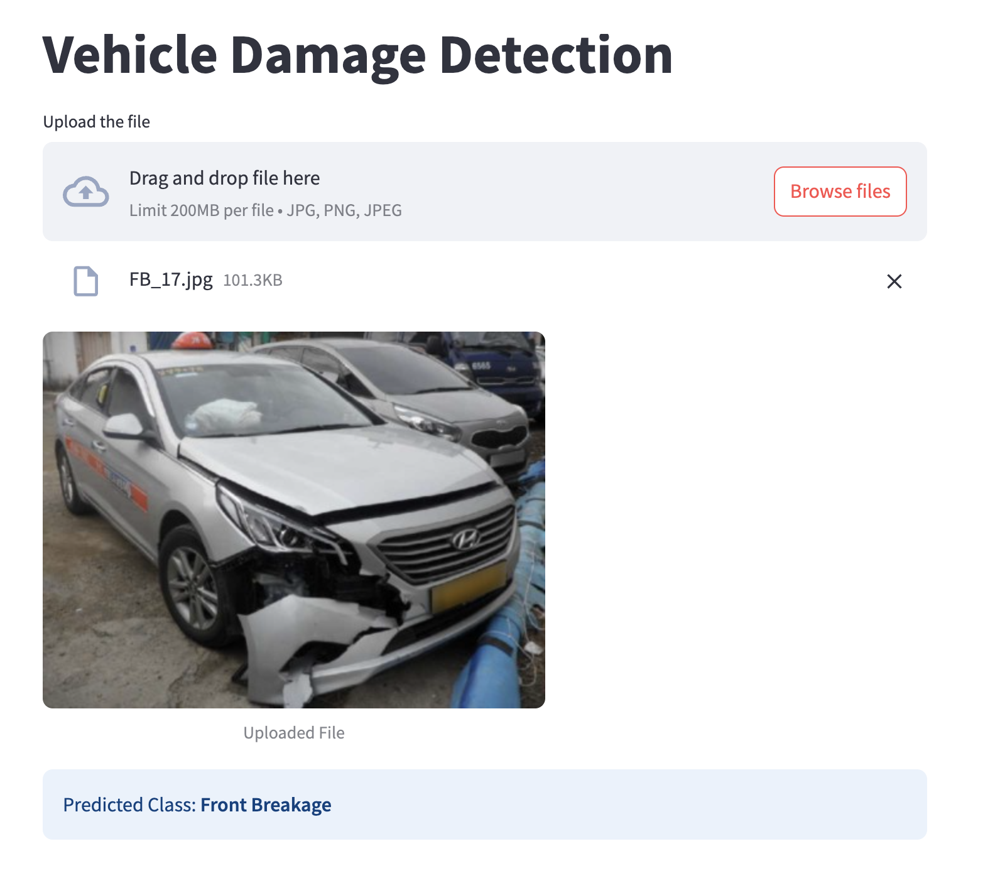

#  Vehicle Damage Detection App  

This project is an end-to-end deep learning application to detect and classify car damage into 6 categories using transfer learning with ResNet50. The model is deployed via a FastAPI backend and accessed through a Streamlit web interface. Users can **upload a car image**, and the model will identify whether the **front or rear part is normal, crushed, or broken**.  
The model is trained to work best with **third-quarter front and rear views** of a car.  

The goal is to automate the detection of car damages from images, which can significantly reduce the manual effort required by insurance or rental companies during claim processing or vehicle return checks.


## Features  
- **Multi-class classification**: 6 damage categories (front/rear - breakage, crushed, normal)
- **FastAPI backend** for quick predictions  
- **Frontend**: Easy-to-use Streamlit web app for image upload and prediction
- **Transfer Learning**: ResNet50 with fine-tuned final layers
- Supports **real-time image uploads**  

## Model Details  

- **Architecture:** ResNet50 (Transfer Learning)  
- **Dataset:** 1,725 images labeled into **6 target classes**:  
  1. **Front Normal**  
  2. **Front Crushed**  
  3. **Front Breakage**  
  4. **Rear Normal**  
  5. **Rear Crushed**  
  6. **Rear Breakage**  
- **Preprocessing:** Image resizing to **224×224**, normalization  
- **Optimizer:** Adam (Learning Rate: 0.0001)  
- **Loss Function:** CrossEntropyLoss  
- **Validation Accuracy:** ~80%  

---

## Setup Instructions  

1. **Install dependencies:**  
```bash
pip install -r requirements.txt
```

2. **Run the FastAPI Backend:**
```bash
fastapi dev server.py
```

3. **Run the Streamlit app:**
```bash
streamlit run app.py
```

## Project Structure
```
📂 vehicle-damage-detection  
├── 📁 fastapi-server/        # Backend using FastAPI  
│   ├── 📁 model/
│   │   │── saved_model.pth  # Trained model weights
│   ├── 📄 server.py          # FastAPI server  
│   ├── 📄 model_helper.py    # Model and inference logic  
│  
├── 📁 streamlit_app/         # Frontend using Streamlit  
│   ├── 📄 app.py             # Streamlit UI for uploading images  
│  
├── 📁 training/              # Model training scripts  
│   ├── 📄 Car_Damage_Detection_Project.ipynb  # Jupyter Notebook  
│  
├── 📄 requirements.txt       # Dependencies  
├── 📄 README.md              # Project documentation  
```
 
 
 


## App Screenshot
Here is a preview of the app in action:




